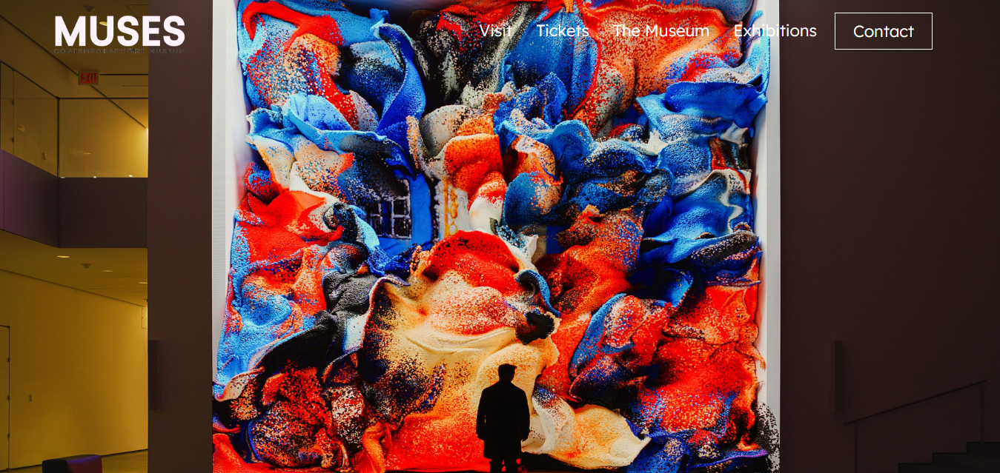
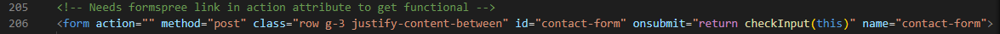
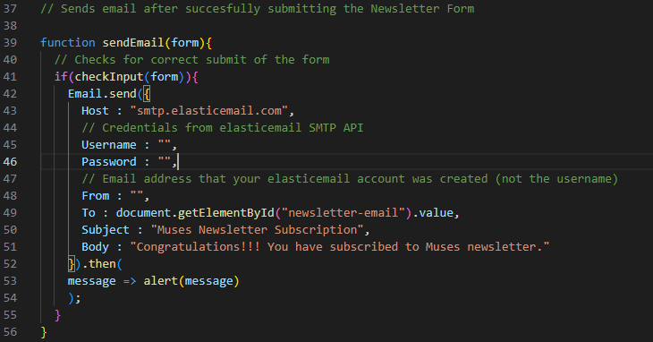

<h1 align="center">Welcome to Muses 🎨</h1>

<h3 align="center">A website for a contemporary art museum located in Athens, Greece 🗽 </h3>

GitHub pages link: https://christosgkoutzis.github.io/Muses/

  

    
    
    
    
    

## Inspiration

This project is based on a <a href="https://www.figma.com/file/bEZ3HklKvYy3wR3OJGKTLn/Coursera-UX-Certificate?type=design&node-id=0%3A1&mode=design&t=hJjj8fMD6y0V59CJ-1">figma design</a> provided by a professional UI-UX designer that will be used as a final project for her "Google UX Design" certificate. It's a static,single-page demonstration of a larger full stack web application of a contemporary museum that is still in progress.

## Purpose

This project has been used as a final project of my CS50x 2023 (Harvard University's Introduction to Computer Science and the arts of Programming). It demonstrates a wide variety of techniques and web development technologies learned throughout the course or by personal research during the development process.

## Features

The project:

-  Copies accurately the provided Figma Design and remains responsive to different screen sizes

-  Provides 2 navigation menus (one on the header and one on the footer) that make user's navigation smooth and easy

-  Includes 2 forms (a contact form and a newsletter form) that are both functional, according to the user's inputs (more details in development section)

## Usage

In order to try the project yourself, you'll need to implement each of the 2 forms of the website functionality yourself (I did not include the code I used to make them functional for privacy reasons). Here's a quick guide (after forking this repo) on how to do that for each of the forms

Contact Form

  

  

  
Complete the action attribute value of index.html file with a URL provided by <a href="https://formspree.io/">Formspree</a> by:

  - Signing up at Formspree website
  
  - Submitting the contact form at Formspree and copying the provided link to the action attribute
  
  - Checking for correct submit of the form on Formspree panel
  

Newsletter Form

  

  

  
Complete the JavaScript snippet's values above (provided by SMTP JS) found in <code>static/js/script.js</code> path by:

  - Signing up at <a href="https://app.elasticemail.com/">ElasticEmail</a> website
  
  - <a href="https://app.elasticemail.com/api/settings/create-smtp">Creating</a> your own SMTP API (credentials) with the email address you used to register (login required)
    
  - Completing <code>Username:</code> and <code>Password:</code> values with the credentails provided by your SMTP API and the <code>From:</code> value with the email address you used to register.
    
  - Checking for correct submit of the form on the inbox of the email submitted through the form.
  

## Development

Muses achieves the implementation of the features mentioned above, by using the following developing techniques:

  -  Use of the 7-1 pattern on the front-end code structure for a managable codebase (More about it <a href="https://openclassrooms.com/en/courses/5625786-produce-maintainable-css-with-sass/5723581-use-the-7-1-pattern-for-a-manageable-codebase">here</a>)
    
  -  Use of SASS preprocessor and <code>.scss</code> syntax for easily maintainable, well-structured and component based stylesheets
    
  -  Wide use of Bootstrap's properties and components for time efficiency and responsiveness
    
  - JavaScript function that checks for empty fields when submitting a form and prompts the user to complete all the fields of the form before doing so

## Roadmap

As mentioned briefly above, this is a single page static front-end demo that is used as a final project for CS50x 2023. The final version of Muses will be a full stack web application that is still in the making. The main additional features of the final version are: 

  -  Multiple routes/pages
  
  -  Use of more backend-database technologies (Python, Flask, SQL etc)

  -  Dynamic creation, demonstration, modification and deletion (based on CRUD) of museum's exhibitions. This process will be available through a simple admin panel that can be only accessed after logging in with admin credentials. 

  -  Ability for a user to buy tickets through his credit card. The application will check for valid credit card number and its type using Python code implemented on a CS50's Problem Set (Credit)

A large part of the backend functionality of these features can be viewed on the <a href="https://github.com/christosgkoutzis/Muses/">main branch of this repo</a> but it is not a part of CS50's final project.

## Contributing

Please feel free to contribute to this project by forking this repo or letting me know about your opinion and/or suggestions on the project.

## Contributors

<a href="https://www.linkedin.com/in/elena-tzerefou-7ab550176/">Elena Tzerefou</a>: Professional UI - UX designer who provided me the Figma designs to make this project true. She came up with the idea of the project and she is playing a key-role on the project's current and upcoming appearance and features.

## License

This project is under the MIT License.
